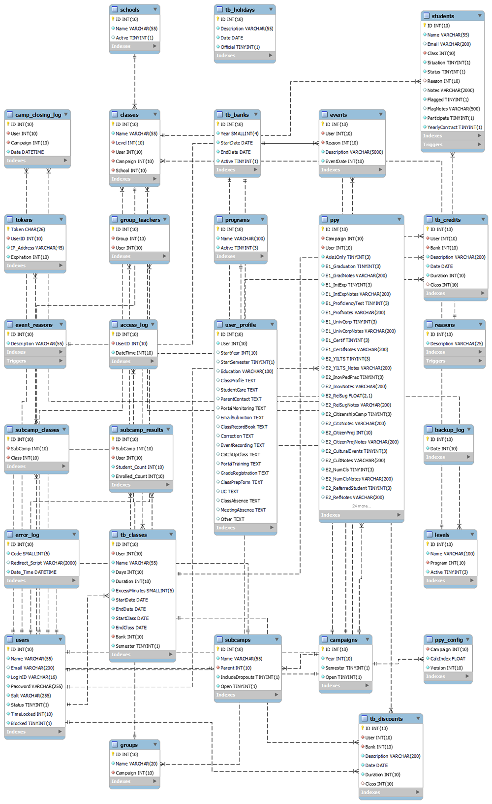

## Re-Enrolment

This project contains a web application used to manage the re-enrollment of students and the teacher’s “time bank” of a private school. The technologies used in its development are PHP, HTML, JavaScript, CSS, Ajax and MySQL.

This is a multi-user application. When a user is created, it is attributed the status of teacher or administrator. When a user is authenticated, the system gives it full access for an admin or limited and specific access to a teacher.

Before inserting the students’ information, some data must be added to the database, such as the name of the teachers and levels of study. After that, the admin must upload the students’ information (name, class attended, level of study, teacher, etc.), this is done using an import tool that reads a file exported from the school’s management application. Some of the information, such as the student’s teacher for that term, is a reference to existing data. If, for example, the teacher information was not previously inserted into the database, the importing tool prompts the creation of a new teacher.

When a new student is added to the system, it receives the status “not contacted”. That may be modified by the admin or the student’s teacher. The status may be updated to “contacted”, “not coming back”, or “enrolled”. The teachers can modify the status of their own students, whereas the admins have full edit access to the students and other sensitive data.

The teacher has an overview of the status of their students, and the admin has an overview of the number referring to all the students through the many different reports generated by the application – such as the number of contacted/uncontacted students, the number of students not coming back and the reasons, the number of enrolled students by teacher, by class, by level, etc.

When the enrollment period is over, the term is closed and a new term may be open. Some of the information from previous terms may be used, such as the teachers and levels of studies, unless there are new teachers or new fields of studies. Students, however, new or old, must have their information imported over again.

Another feature of this application is the management of the teachers’ “time bank”. It stores the number of overtime and undertime hours performed by the teachers and shows if the teacher has hours to pay or has to get paid for overtime hours. As the re-enrollment, each teacher may only view their own data, while the admins have full view and edit access to the data.

There is also a management section that only the admins have access. In this section, the admins may perform a database backup, add/remove/enable/disable the access of teachers or other admins, create new teachers/admins, check the access log, change login ids and passwords, etc.

The data for this application is stored into a MySQL server database.

### MIT License

**Copyright (c) 2022 Pablo Borges**

Permission is hereby granted, free of charge, to any person obtaining a copy of this software and associated documentation files (the "Software"), to deal in the Software without restriction, including without limitation the rights to use, copy, modify, merge, publish, distribute, sublicense, and/or sell copies of the Software, and to permit persons to whom the Software is furnished to do so, subject to the following conditions:

The above copyright notice and this permission notice shall be included in all copies or substantial portions of the Software.

THE SOFTWARE IS PROVIDED "AS IS", WITHOUT WARRANTY OF ANY KIND, EXPRESS OR IMPLIED, INCLUDING BUT NOT LIMITED TO THE WARRANTIES OF MERCHANTABILITY, FITNESS FOR A PARTICULAR PURPOSE AND NONINFRINGEMENT. IN NO EVENT SHALL THE AUTHORS OR COPYRIGHT HOLDERS BE LIABLE FOR ANY CLAIM, DAMAGES OR OTHER LIABILITY, WHETHER IN AN ACTION OF CONTRACT, TORT OR OTHERWISE, ARISING FROM, OUT OF OR IN CONNECTION WITH THE SOFTWARE OR THE USE OR OTHER DEALINGS IN THE SOFTWARE.

